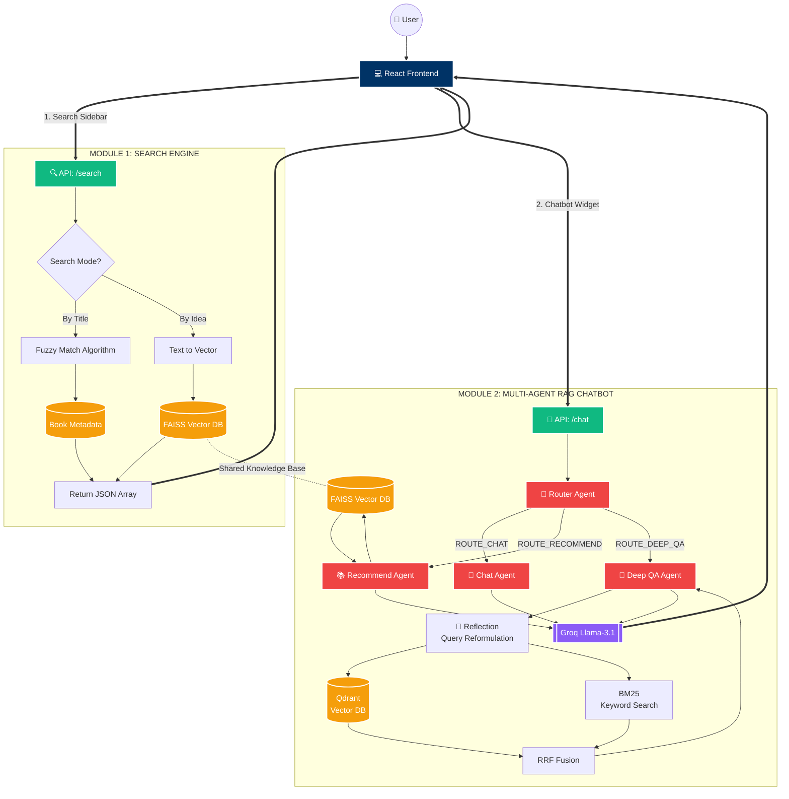

#  RAG Smart Library

A comprehensive Fullstack application that implements **Retrieval-Augmented Generation (RAG)** to provide intelligent book recommendations and deep book Q&A. The system transitions from traditional keyword searching to semantic "idea-based" discovery using Vector Databases and Large Language Models (LLMs).

---

##  System Architecture: The Dual-Engine Design

The project operates on a strict dual-engine architecture, separating the data-driven search functionality from the conversational AI, while efficiently sharing backend resources (FastAPI & FAISS).

### 1.  Module 1: Search Engine (Discovery Mode)
Triggered via the React sidebar, this module is built for speed and direct book retrieval, returning structured JSON arrays to render book cards.
* **Title Search (Fuzzy Match):** Fast string matching logic to find specific book names while handling minor user typos.
* **Idea Search (Semantic Search):** Converts conceptual user queries (e.g., "books about existential crisis") into mathematical vectors. It scans the shared **FAISS (Facebook AI Similarity Search)** database to retrieve books based on deep meaning rather than exact keywords.

---

### 2.  Module 2: RAG Chatbot — Multi-Agent System


#### 2.1 Agent Architecture (LangGraph)
The system uses a **StateGraph** to route every user message through the appropriate agent automatically:

```
User Message
     ↓
 Router Agent  ──→  classify intent
     │
     ├──→ 📚 Recommend Agent   (FAISS + Groq)
     ├──→ 🧙 Deep QA Agent     (Qdrant + BM25 + Reflection + Groq)
     └──→ 💬 Chat Agent        (Groq)
```

| Route | Trigger | Engine |
|---|---|---|
| `ROUTE_RECOMMEND` | User asks for book suggestions | FAISS semantic search |
| `ROUTE_DEEP_QA` | User asks about plot/characters in a specific book | Qdrant + BM25 Hybrid Search |
| `ROUTE_CHAT` | Greetings, general chit-chat | Direct LLM |

#### 2.2 Deep QA Pipeline — Hybrid Search + Reflection

The most advanced component. When a user asks a deep question about a book (e.g., *"Why did Sirius Black give Harry the Firebolt?"*), the system runs a 3-step pipeline:

**Step 1 — Reflection (Query Reformulation)**

Before searching, an LLM reformulates the user's question into a more complete, search-optimized query:
```
User:      "Why did Sirius give the Firebolt?"
Reflected: "What was Sirius Black's reason for sending/gifting
            Harry Potter the Firebolt broomstick in Prisoner of Azkaban?"
```
This solves the **vocabulary mismatch problem** — the book may use "sent" while the user asks "give", causing naive search to miss the relevant passage. Reflection also uses **chat history** to resolve pronouns ("he", "it") into full names.

**Step 2 — Hybrid Search (Dense + BM25 + RRF Fusion)**

Two complementary search engines run in parallel on the reflected query:

| Engine | Method | Strength |
|---|---|---|
| **Dense Search** (Qdrant) | Semantic vector similarity | Understands meaning and context |
| **BM25 Search** (rank-bm25) | Keyword frequency matching | Finds exact names and phrases |

Results are merged using **Reciprocal Rank Fusion (RRF)** — chunks that score well in both engines are ranked highest, maximizing precision.

**Step 3 — LLM Answer Generation**

Top retrieved chunks are injected as context into Groq (Llama-3.1-8B), which synthesizes a detailed answer in Vietnamese. The LLM is strictly instructed to answer only from the provided context, preventing hallucination.

#### 2.3 Chat History & Context Awareness
Chat history is maintained across the entire session and passed to the Reflection step, enabling coherent multi-turn conversations:
```
Turn 1 — User: "Sirius Black là ai?"         → AI answers
Turn 2 — User: "Tại sao ông ấy trốn thoát?" → Reflection resolves "ông ấy" → "Sirius Black"
```

---

### 3.  Frontend Presentation Layer
Built with **React.js**, the frontend focuses on professional minimalism and real-time interaction.
* **Discovery Engine:** A "Curated Discovery" grid automatically fetches 9 random books every 10 seconds via a background interval, ensuring the landing page always feels fresh.
* **Safe Rendering:** Integrated `ReactMarkdown` to parse AI responses safely, with custom component overrides to handle complex formatting, prevent UI-breaking errors, and block hallucinated images.

---

##  Tech Stack

| Layer | Technology |
|---|---|
| **Language** | Python 3.x, JavaScript (ES6+) |
| **Frameworks** | FastAPI, React.js (Vite) |
| **Agent Orchestration** | LangGraph |
| **Vector DB (Books)** | FAISS |
| **Vector DB (Book Content)** | Qdrant (local) |
| **Keyword Search** | rank-bm25 |
| **Embedding Model** | nomic-ai/nomic-embed-text-v1.5 |
| **LLM** | Groq API (Llama-3.1-8B-Instant) |
| **Security** | Dotenv (.env) for API key management |
| **Formatting** | React Markdown, Custom CSS `@keyframes` |

---

##  Installation & Setup

### Backend
```bash
# Install core dependencies
pip install fastapi uvicorn groq faiss-cpu python-dotenv

# Install AI Agent dependencies
pip install langgraph qdrant-client sentence-transformers rank-bm25 langchain-text-splitters transformers

# Configure environment
# Add GROQ_API_KEY to your .env file

# Build the Qdrant + BM25 index (run once)
python create_qdrant_database.py

# Start server
uvicorn main:app --reload
```

### Frontend
```bash
npm install
npm install react-markdown
npm run dev
```

---

##  System Block Diagram



---

##  Video Demo
**[Drive Link](https://drive.google.com/file/d/1-qFh57czCc0QnIOQNK_dztiEoabyw7h1/view?usp=sharing)**
