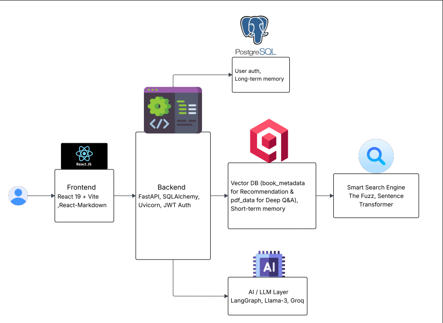
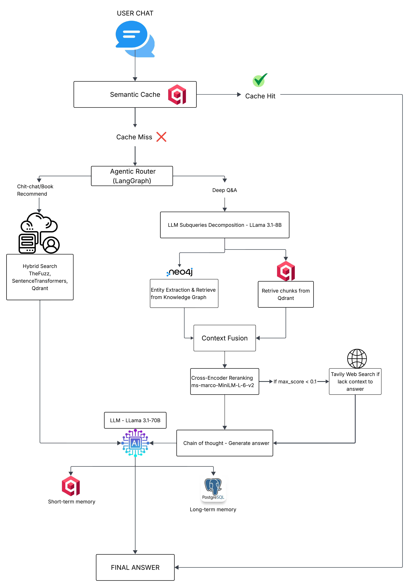
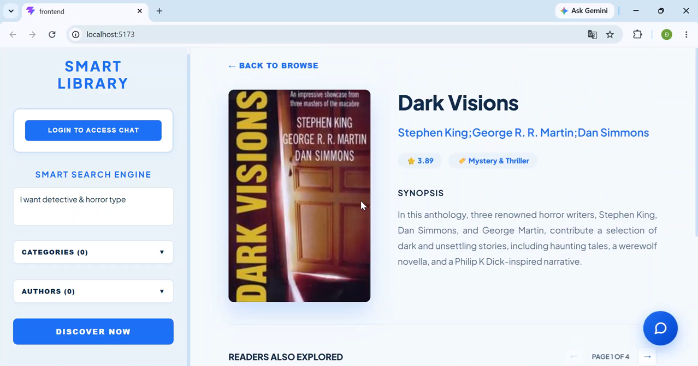
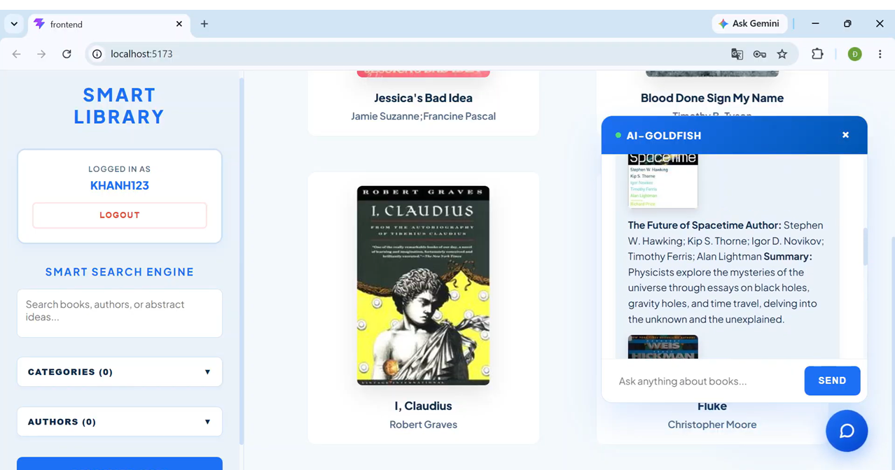
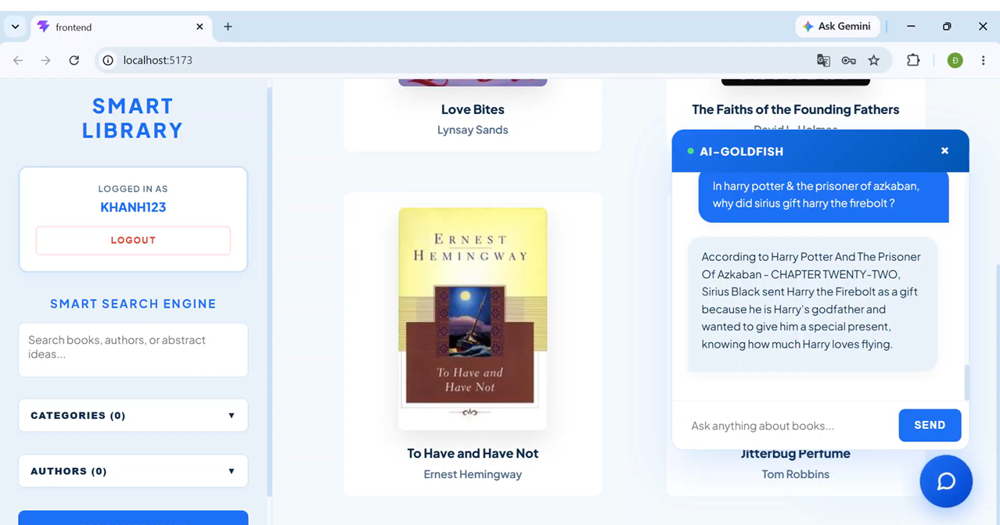

# Smart Library

Smart Library is a fullstack, AI-native library platform that combines **semantic book recommendation**, **multi-agent RAG (Retrieval-Augmented Generation)** for deep in-book Q&A, and a **hybrid memory system** (short-term + long-term) to deliver personalized, context-aware conversations — all wrapped in a fast, cached, production-style architecture.

---
## System Architecture

### Diagram 1 — System Overview

An overview of the key components and data flows between the Frontend, Backend, Storage, and AI Agent.

---

### Diagram 2 — Chatbot Deep Dive: Multi-Agent RAG Pipeline

---
## Key Features

### 1. Smart Search Engine — Book Discovery

- **Hybrid Book Search** — combines exact/fuzzy title matching (`TheFuzz`) with semantic vector search (`BAAI/bge-m3` + Qdrant) so a query like a misspelled book title or a vague idea ("a book about loneliness in space") both work well.
- **Filter-based Discovery** — users can narrow results by categories and authors, in addition to free-text or idea-based search, then hit "Discover Now" to surface curated recommendations.
- **Curated Recommendations** — Cross-Encoder reranking (`ms-marco-MiniLM-L-6-v2`) surfaces the most relevant books for the user's query before results are shown.

### 2. AI Chatbot — Multi-Agent RAG Pipeline

Instead of a single LLM call answering everything, Smart Library routes each user message through a **LangGraph agentic pipeline** that decides whether the user wants a casual chat / book recommendation, or a deep factual answer that requires reasoning over actual book content — pulled from both a **vector database** and a **knowledge graph**.

- **Agentic Router (LangGraph)** — classifies every message as `ROUTE_GENERAL` (chit-chat / recommendations) or `ROUTE_DEEP_QA` (specific plot/character questions) and dispatches to a dedicated node.
- **Multi-Hop Deep Q&A Pipeline** —
  - Decomposes complex questions into multiple sub-queries via LLM (multi-query expansion).
  - Extracts entities and queries a **Neo4j knowledge graph** for relational facts (who did what, to whom).
  - Retrieves and deduplicates relevant chunks from **Qdrant** across all ingested books.
  - **Context Fusion**: merges graph facts + vector chunks.
  - **Cross-Encoder Reranking** (`ms-marco-MiniLM-L-6-v2`) to surface the most relevant evidence.
  - Falls back to **live web search (Tavily)** automatically when retrieval confidence is too low.
  - Final answer generated with explicit **Chain-of-Thought reasoning** and mandatory source citation.
- **Semantic PDF Ingestion** — parses books with PyMuPDF, detects chapters via regex, and chunks text using **semantic similarity boundaries** (sentence-embedding cosine similarity) instead of naive fixed-length splitting, preserving topic coherence with sentence-level overlap.
- **Hybrid Memory System**
  - **Short-term memory**: per-session conversational memory stored as embeddings in Qdrant, retrieved semantically (not just by recency).
  - **Long-term memory**: a background task asynchronously extracts stable user preferences (favorite genres, goals, communication style, etc.) from every message via LLM and merges them into a persistent JSON profile in PostgreSQL — without ever blocking the chat response.
  - A carefully engineered **memory-injection prompt** governs how/when long-term vs. short-term memory should override each other and how the assistant should *use* (not parrot) memory.
- **Semantic Caching** — a Qdrant-backed semantic cache intercepts repeated/similar questions and returns instant cached answers, skipping the full agent pipeline entirely on cache hits.

### 3. Platform Essentials

- **Authentication** — JWT-based auth (FastAPI + SQLAlchemy + PostgreSQL) with per-user chat history (Redis) and per-user long-term profiles.
- **Modern Web UI** — React 19 + Vite frontend with Markdown rendering for chat responses (including inline book cover images).

---

**Request flow (chat endpoint):**

1. **Semantic Cache check** (Qdrant) → if similar question seen before, return cached answer instantly.
2. **Cache miss** → **Agentic Router (LangGraph)** classifies intent:
   - **General / Recommendation path** → Hybrid Search (fuzzy + semantic) → Cross-Encoder rerank → LLM generates a warm, markdown-formatted recommendation response.
   - **Deep Q&A path** → Multi-query decomposition → parallel retrieval from **Neo4j** (entities/relations) and **Qdrant** (book chunks) → Context Fusion → Cross-Encoder rerank → (Tavily web search fallback if confidence is low) → Chain-of-Thought answer generation with citations.
3. Response is saved to **short-term semantic memory** and **Redis chat history**; **long-term preference extraction** runs as a non-blocking background task.

---

## Tech Stack

| Layer | Technology |
|---|---|
| Frontend | React 19, Vite, React-Markdown |
| Backend | FastAPI, SQLAlchemy, Uvicorn, JWT Auth |
| Orchestration | LangGraph (multi-node agent graph), Groq (Llama 3.1-8B / 3.1-70B / 3.3-70B) |
| Vector Search | Qdrant, `BAAI/bge-m3` embeddings, `sentence-transformers` Cross-Encoder reranker |
| Knowledge Graph | Neo4j (entity/relationship extraction via LLM) |
| Relational DB | PostgreSQL (users, long-term memory profiles) |
| Caching / Session | Redis (Upstash) — chat history; Qdrant — semantic LLM-response cache |
| Fuzzy Search | TheFuzz |
| Web Search Fallback | Tavily API |
| PDF Processing | PyMuPDF (fitz), NLTK sentence tokenization, semantic chunking via cosine similarity |

---

## How Deep Q&A Works (Multi-Hop RAG)

1. **Multi-query decomposition** — the original question is expanded into several sub-queries to cover different reasoning angles (identity, motive, action, event), resolving pronouns to full entity names.
2. **Dual retrieval**:
   - **Graph retrieval**: entities are extracted from the question and matched against the Neo4j knowledge graph to surface explicit relationships.
   - **Vector retrieval**: each sub-query is run against every book's Qdrant collection; results are deduplicated across all sub-queries and collections.
3. **Context Fusion**: graph facts are prioritized at the top of the context to anchor logical structure, followed by reranked text chunks.
4. **Cross-Encoder Reranking** ensures only the most relevant chunks reach the LLM, reducing noise and hallucination.
5. **Web Search Fallback**: if the best reranked score falls below a confidence threshold, Tavily web search results are blended into the context automatically.
6. **Chain-of-Thought generation**: the LLM is instructed to reason step-by-step inside `<thinking>` tags before producing a cited `Final Answer`, which is then parsed and cleaned before being shown to the user.

---

## Semantic PDF Ingestion Pipeline

Books are ingested through a custom pipeline (`pdf_ingest.py`) rather than naive fixed-size chunking:

1. **Clean text extraction** with PyMuPDF, normalizing hyphenation and whitespace artifacts.
2. **Chapter detection** via regex (supports numeric, roman numeral, and spelled-out chapter numbers).
3. **Semantic chunking**: sentences are embedded with `BAAI/bge-m3`, and consecutive sentences are grouped into a chunk until either (a) cosine similarity drops below a topic-shift threshold, or (b) a max-token budget is reached — with **sentence-level overlap** carried into the next chunk to preserve pronoun/context continuity.
4. Chunks are pushed to Qdrant (per-book collections) and entities/relations extracted via LLM are pushed to Neo4j (`graph_ingest.py`), processed concurrently with a thread pool and automatic retry/backoff on rate limits.

---

## Memory System

- **Short-term memory** (`memory_manager.py`, `qdrant_manager.py`): every user↔AI exchange is embedded and stored per `user_id` + `session_id`; relevant past exchanges are retrieved semantically (not just last-N) to enrich the prompt context.
- **Long-term memory** (`long_term_memory.py`): runs as a `BackgroundTask` after every chat message — an LLM extracts stable facts (name, occupation, favorite genres/authors, goals, communication style) into a structured JSON schema, strictly preserving prior data unless explicitly contradicted, and persists it to the user's PostgreSQL profile.
- Both layers are injected into the system prompt with explicit **priority rules** (short-term overrides long-term on conflict) and strict anti-leakage instructions so the assistant uses memory naturally without ever saying "Based on your profile...".

---

## Demo
## Watch full DEMO VIDEO via this link: **[Google Drive](https://drive.google.com/file/d/14h6c08E-lZnMPWTPMBk63LJtwOBNX4YI/view?usp=drive_link)**
### Here are some photos for demo

---

## RAG Evaluation — RAGAS Report

The chatbot's Deep QA pipeline was evaluated using the **[RAGAS](https://docs.ragas.io/)** framework across **15 test cases** covering chit-chat, book recommendations, and factual Q&A over the Harry Potter corpus.

### Metric Results

| Metric | Description | Score |
| :--- | :--- | :---: |
| **Context Precision** | Are retrieved chunks relevant to the question? | 0.667 |
| **Context Recall** | Does the retrieved context cover the reference answer? | 0.667 |
| **Faithfulness** | Is the generated answer grounded in retrieved context (no hallucination)? | 0.700 |
| **Answer Relevancy** | Is the answer on-topic and directly addressing the user's question? | 0.879 |

> Scores range from 0.0 (worst) to 1.0 (best). Metrics with fewer valid samples reflect cases where the pipeline routed to General (chit-chat) node and no retrieval was performed.

### Key Observations

- **Answer Relevancy (0.879)** is the strongest metric — the chatbot consistently stays on-topic and gives coherent, relevant responses.
- **Faithfulness (0.700)** indicates room for improvement in grounding answers strictly within retrieved context, particularly for ambiguous or cross-book queries.
- **Context Recall (0.667)** suggests the vector search occasionally misses relevant passages — a candidate for tuning chunk size or retrieval `top-K`.
- **Context Precision (0.667)** shows that when context is retrieved, most chunks are relevant, but some noise remains before re-ranking.
